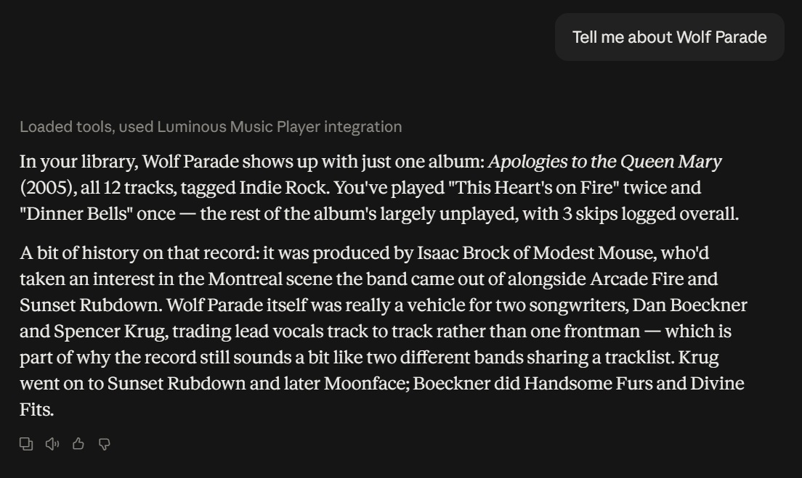

# Luminous MCP Server

A [Model Context Protocol (MCP)](https://modelcontextprotocol.io/) server for [Luminous Music Player](https://github.com/esoltys/luminous).

Connects your AI assistants (Claude Desktop, Antigravity, Cursor, Zed, Ollama) to your local music library.



## ✨ Features

- **Library Search & Filtering**: Search tracks, albums, artists, genres, composers, and lyrics using SQLite FTS5. Filter by BPM, LUFS loudness, dynamic range, and bit depth.
- **Listening Analytics**: Inspect play counts, skip rates, top tracks/artists, and forgotten favorites.
- **Playlist Management**: Query, generate, and populate static and dynamic playlists.
- **Metadata Hygiene**: Audit library for missing tags (album art, composer, year, lyrics) and assist in custom genre taxonomy assignment.
- **Playback Control**: Interact with running Luminous instances for transport controls (play, pause, next, seek, volume).

## 🛠️ Available MCP Tools

- **`ping`**: Check server connectivity, uptime, and database health status.
- **`get_server_info`**: Inspect server metadata, SQLite database path resolution, schema version, and library size.
- **`search_library`**: Full-text search and structured filtering across tracks (artist, album, genre, composer, release year, BPM tempo, LUFS loudness).
- **`get_track_details`**: Retrieve deep audio metadata, acoustic measurements, lyrics, MusicBrainz IDs, and playback stats for a track.
- **`get_artist_summary`**: Aggregate artist catalog statistics, albums, genres, collaborators, and listening metrics.
- **`get_listening_stats`**: Analyze listening habits, top tracks, top artists, frequently skipped tracks, and forgotten favorites (frequently played tracks unplayed for $N$ months).
- **`get_recent_history`**: Chronological playback log from `play_history` with timestamps, durations, and playback context (album, song, or playlist).

## 🚀 Getting Started

### Prerequisites

- [Bun](https://bun.sh) (v1.1+)
- [Luminous Music Player](https://github.com/esoltys/luminous) installed with a music library scanned

### Installation

```bash
git clone https://github.com/esoltys/luminous-mcp.git
cd luminous-mcp
bun install
bun run build
```

### Running the Server

```bash
bun run start
```

### One-Click Install (Claude Desktop)

Install directly via the official [MCP Bundle (.mcpb)](https://github.com/modelcontextprotocol/mcpb) format:

1. Build the bundle:
   ```bash
   bun run package:mcpb
   ```
2. Open Claude Desktop, go to **Settings > Extensions**, and drag `dist/luminous-mcp.mcpb` into the window.
3. Click **Install**. The extension runs a self-contained binary with zero external dependencies.

### Manual Configuration (Claude Desktop, Antigravity, Cursor)

Alternatively, add `luminous` to your `claude_desktop_config.json` or MCP client configuration:

```json
{
  "mcpServers": {
    "luminous": {
      "command": "bun",
      "args": ["run", "C:/path/to/luminous-mcp/src/index.ts"]
    }
  }
}
```

## 🛠️ Development

- **Typecheck**: `bun run typecheck`
- **Tests**: `bun test`
- **Build**: `bun run build`

## 📄 License

MIT © Eric James Soltys